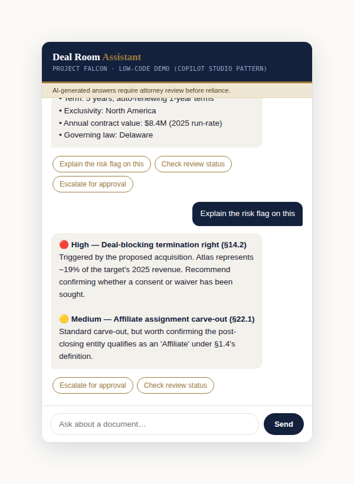
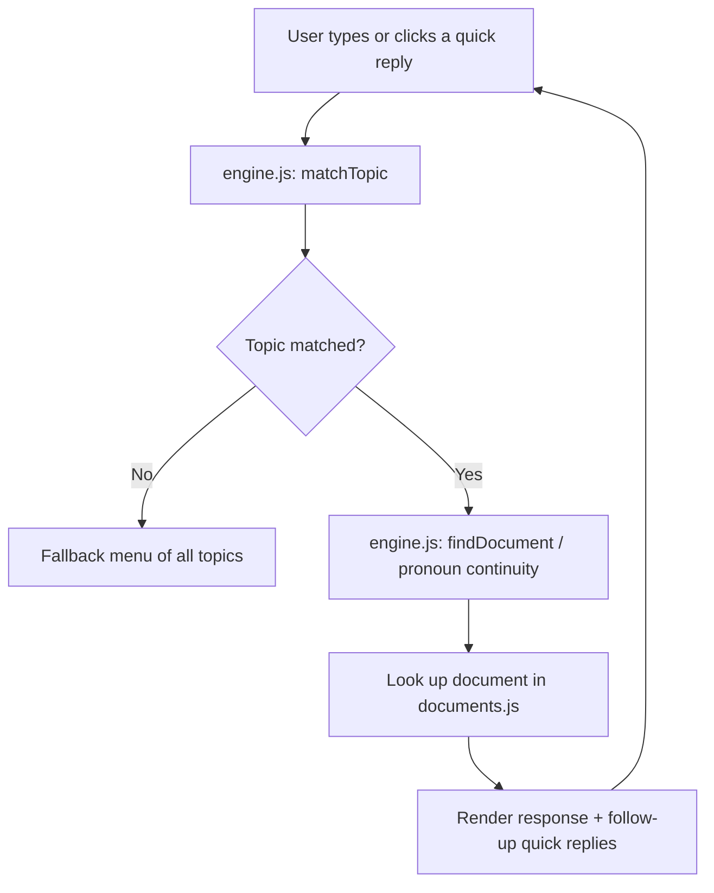
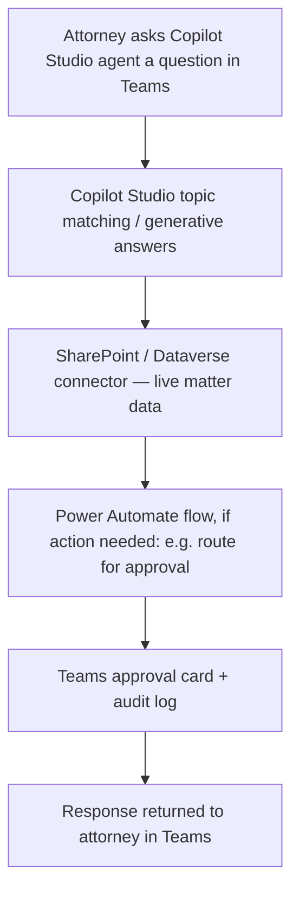

# Deal Room Assistant - Low-Code Legal AI Chatbot Demo

A working chatbot demo built to prepare for the **Manager of AI Transformation** role at Mayer Brown. It answers questions about a fictional M&A due-diligence matter, summarizing documents, checking review status, explaining AI-flagged risks, and routing items for attorney approval using a **low-code, config-driven design that mirrors how Microsoft Copilot Studio structures a real agent.**

**[▶ Live demo](https://shalineesinghvit12-source.github.io/deal-room-assistant/)**



---

## Why this exists

The role's job description names a specific stack — Microsoft Copilot, the M365 ecosystem, Power Automate, Power Apps, and legal platforms like iManage, Intapp, and Litera with an explicit emphasis on **low-code delivery**, not custom AI engineering. This project is a portable way to demonstrate that same design pattern outside a Microsoft tenant, since a real Copilot Studio agent can't be publicly shared or opened in a browser.

It is **not** a production system, and it deliberately avoids anything that would misrepresent it as one no real client data, no real firm name in the data layer, no vector database, no backend server, and no claim that this *is* Copilot Studio. It's a static, client-side illustration of the same architecture, built to be read, run, and discussed in about five minutes.

## What "low-code" means in this repo

The whole point of the project is the separation between **logic that's declared as data** and **code that interprets it** — the same separation Copilot Studio enforces between its topic canvas and its underlying engine:

| File | Role | Analogous to (in production) |
|---|---|---|
| `documents.js` | The data — matter documents, summaries, risk flags | SharePoint / Dataverse, via a live connector |
| `topics.js` | The conversation design — trigger phrases, topic labels | Copilot Studio's topic canvas |
| `engine.js` | A thin, generic interpreter — matches input to topics | Copilot Studio's built-in NLU / orchestration engine |
| `index.html` + `style.css` | The chat surface | Teams / a Copilot Studio channel |

To add a new conversational capability, you edit `topics.js` (and optionally `documents.js`) — `engine.js` shouldn't need to change. That's the same authoring experience a business analyst has in Copilot Studio: design the conversation, not the code.

## Architecture



In production, this becomes:



See [`docs/ARCHITECTURE.md`](docs/ARCHITECTURE.md) for the full production mapping, including how this connects to the Power Automate flows and SharePoint tracking list from the companion implementation guide.

## Try it

Ask (or click a quick reply for) things like:

- *"Summarize the MSA"*
- *"What's still pending on Project Falcon?"*
- *"Why was section 14.2 flagged?"*
- *"Send the CTO employment agreement for approval"*

The bot remembers the last document you discussed, so a follow-up like *"explain the risk flag on this"* resolves correctly without repeating the document name.

## Running it locally

No build step, no dependencies, no server required.

```bash
git clone https://github.com/<your-username>/mayer-brown-deal-room-assistant.git
cd mayer-brown-deal-room-assistant
open index.html   # or just double-click the file
```

## Publishing to GitHub Pages

1. Push this repo to GitHub (see the commands in the accompanying setup notes).
2. In the repo, go to **Settings → Pages**.
3. Under **Source**, select **Deploy from a branch**, branch `main`, folder `/ (root)`, then **Save**.
4. GitHub will publish it at `https://<your-username>.github.io/mayer-brown-deal-room-assistant/` within a minute or two.
5. Come back and swap the **Live demo** link at the top of this README for that URL.

## Relationship to the rest of the pilot

This chatbot is the conversational front end for the same **Deal Room Intelligence Assistant** pilot described in the full program proposal — the same fictional matter (Project Falcon), the same documents, the same risk flags. The companion materials cover the pieces this repo doesn't:

- **Program proposal** — business case, roadmap, KPIs, governance.
- **Copilot & Power Automate implementation guide** — the real flow logic (trigger/action names, sample flow JSON) this demo's `engine.js` is standing in for.
- **Step-by-step setup guide** — click-by-click instructions to build the actual SharePoint + Power Automate + Copilot Studio version in a real tenant.

## Limitations, stated plainly

- All data is fictional and hard-coded in `documents.js` — nothing here reads from a real system.
- The trigger-phrase matching in `engine.js` is intentionally simple; Copilot Studio's real NLU and generative answers are considerably more capable.
- There is no authentication, no permission scoping, and no audit logging here — Section 9 of the implementation guide covers how those are enforced in the real build.

## License

MIT — see [`LICENSE`](LICENSE). Sample content is fictional and provided for demonstration purposes only.
