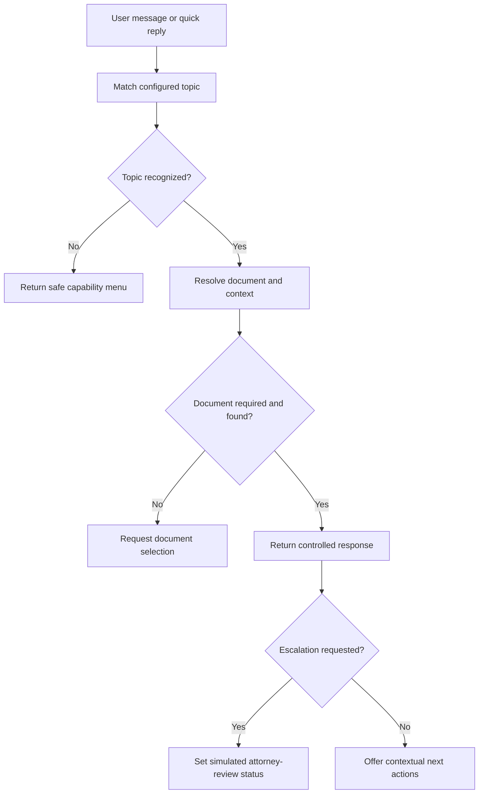
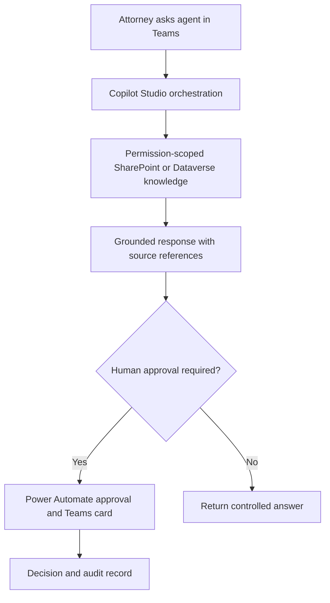

# Deal Room Assistant

A governed, low-code legal AI chatbot prototype that I designed and implemented to demonstrate the complete lifecycle of an AI transformation use case, from problem discovery and requirements through working software, testing, governance and adoption planning.

The assistant supports a fictional M&A due-diligence matter named **Project Falcon**. It summarizes documents, reports review status, explains configured risk flags, maintains conversational context and routes selected items into a simulated attorney-review state.

**[Open the live demonstration](https://shalineesinghvit12-source.github.io/deal-room-assistant/)**


## Executive summary

Deal teams can spend substantial time moving between document repositories, trackers, email and chat to answer recurring questions. I used that problem to design a focused assistant with four controlled capabilities:

1. Summarize a known matter document.
2. Show document-level or matter-wide review status.
3. Explain why a configured clause or document was risk-flagged.
4. Route a selected item for attorney review.

I deliberately kept the public implementation transparent and portable. It runs entirely in the browser using synthetic data and deterministic conversation matching. The target enterprise design maps the same experience to Microsoft Copilot Studio, Teams, SharePoint or Dataverse, Power Automate, Entra ID and governed audit controls.

## My role and contribution

I owned the project as a combined business analyst, product owner and prototype implementer. My work included:

- Defining the problem, scope, personas, value hypothesis and pilot measures.
- Translating stakeholder needs into requirements, use cases and user stories.
- Building the requirements traceability matrix.
- Designing the conversational journey and exception behavior.
- Implementing the working HTML, CSS and JavaScript chatbot.
- Creating the synthetic document, status and risk model.
- Testing core journeys, negative paths and contextual follow-ups.
- Designing the Microsoft 365 target architecture.
- Defining governance, security, approval and audit controls.
- Preparing the delivery roadmap, adoption plan and operating model.

## Implemented capabilities

| Capability | Evidence |
| --- | --- |
| Conversational entry point | Free-text input, keyboard submission and quick replies |
| Document summaries | Controlled summaries and key terms from `documents.js` |
| Review-status visibility | Named-document and matter-wide status responses |
| Risk explanation | Configured severity, title and rationale |
| Context continuity | Follow-ups using “this,” “it” and “that” resolve to the previous document |
| Clarification | The assistant requests a document when none can be resolved |
| Safe fallback | Unsupported requests return a defined capability menu |
| Human-in-the-loop pattern | Escalation changes the demo status to pending attorney review |
| Governance notice | Persistent warning that attorney review is required |
| Portable deployment | Static GitHub Pages implementation with no external dependencies |

## End-to-end delivery evidence

| Lifecycle stage | Repository artifact |
| --- | --- |
| Problem framing and business value | [Project Charter and Business Case](docs/01-PROJECT-CHARTER-AND-BUSINESS-CASE.md) |
| Stakeholders, scope and measures | [Project Charter and Business Case](docs/01-PROJECT-CHARTER-AND-BUSINESS-CASE.md) |
| Requirements, use cases and user stories | [Requirements, Use Cases and User Stories](docs/02-REQUIREMENTS-USE-CASES-AND-USER-STORIES.md) |
| Requirements traceability | [Requirements Traceability Matrix](docs/03-REQUIREMENTS-TRACEABILITY-MATRIX.md) |
| Solution and exception design | [Solution Design and Implementation Record](docs/04-SOLUTION-DESIGN-AND-IMPLEMENTATION.md) |
| Technical architecture | [Demo and Production Architecture](docs/ARCHITECTURE.md) |
| UAT and negative testing | [UAT, Test Strategy and Results](docs/05-UAT-TEST-STRATEGY-AND-RESULTS.md) |
| Governance, security and RACI | [Governance, Risk, Security and Controls](docs/06-GOVERNANCE-RISK-SECURITY-AND-CONTROLS.md) |
| Roadmap, adoption and operations | [Delivery Roadmap, Change and Operating Model](docs/07-DELIVERY-ROADMAP-CHANGE-AND-OPERATING-MODEL.md) |
| Interview presentation and evidence boundary | [Portfolio Evidence and Interview Guide](docs/08-PORTFOLIO-EVIDENCE-AND-INTERVIEW-GUIDE.md) |

## Demonstration journey

Try these questions in sequence:

1. **“Summarize the MSA.”**
2. **“Explain the risk flag on this.”**
3. **“What is still pending on Project Falcon?”**
4. **“Send the CTO employment agreement for approval.”**
5. Enter an unsupported question to show the safe fallback.

This sequence demonstrates grounding in controlled records, context continuity, matter status, human escalation and failure-safe behavior.

## Low-code design pattern

I separated declarative configuration from generic execution logic. A business analyst can add trigger phrases or maintain document content without rewriting the complete application.

| File | Responsibility | Production equivalent |
| --- | --- | --- |
| `documents.js` | Fictional matter documents, summaries, terms, statuses and risk flags | Permission-scoped SharePoint or Dataverse records |
| `topics.js` | Conversation topics, trigger phrases and labels | Copilot Studio topics and orchestration instructions |
| `engine.js` | Intent matching, document resolution, context and routing | Copilot Studio orchestration and agent tools |
| `index.html` and `style.css` | Conversational user experience | Copilot Studio agent published to Teams |
| GitHub Pages | Public portfolio hosting | Governed Microsoft 365 tenant |

To add a new conversational capability, the topic and document configuration can be extended independently of the interface. This reflects the maintainability principle behind low-code platforms.

## Implemented workflow



## Microsoft 365 target workflow



A production implementation would also include Entra ID authentication, matter-level access, data-loss prevention, retention, audit telemetry, connector monitoring and documented support ownership.

## Exception handling

The implemented prototype:

- Requests clarification when no document can be resolved.
- Maintains pending context when the user is selecting a document.
- Returns a safe task menu for unsupported requests.
- Performs no action for an empty message.
- Keeps attorney-review expectations visible.

The target design adds source-availability checks, authorization failures, connector retries, duplicate-request prevention, approval timeouts, operational alerts and a fail-safe response when grounding is insufficient.

## Run locally

No build process, package installation or backend is required.

```bash
git clone https://github.com/shalineesinghvit12-source/deal-room-assistant.git
cd deal-room-assistant
```

Open `index.html` in a modern browser.

## Automated regression tests

The conversation engine has dependency-free Node.js regression tests covering summaries, matter status, clarification, contextual follow-ups, attorney-review routing and safe fallback behavior.

```bash
npm test
```

GitHub Actions runs the same test suite for every push to `main` and for pull requests.

## Architecture boundary

This repository contains a working browser prototype, not a production legal system.

- All people, documents, organizations, risks and matter information are fictional.
- The implementation uses deterministic trigger-phrase matching, not a language model.
- The escalation step simulates status routing; it does not send a live Teams approval.
- Authentication, permission scoping and audit logging are documented as target controls, not claimed as deployed.
- The assistant does not provide legal advice and does not replace source-document or attorney review.

This boundary is intentional. It allows the implementation to be inspected and demonstrated publicly without exposing confidential data or overstating platform experience.

## Technology and delivery skills demonstrated

- Business analysis and requirements engineering
- Stakeholder and process analysis
- Use cases, user stories and acceptance criteria
- Requirements traceability matrix
- UAT and negative-path testing
- Legal AI use-case design
- Conversational UX and low-code patterns
- HTML, CSS and JavaScript
- Copilot Studio and Power Automate architecture
- SharePoint, Dataverse, Teams and Entra ID integration design
- Human-in-the-loop governance
- Risk, security, adoption and operating-model design

## Author

**Shalinee Singh**

I created this project as an independent professional portfolio implementation. It is not affiliated with, commissioned by or deployed at any law firm or client organization.

## License

MIT License. See [LICENSE](LICENSE).
